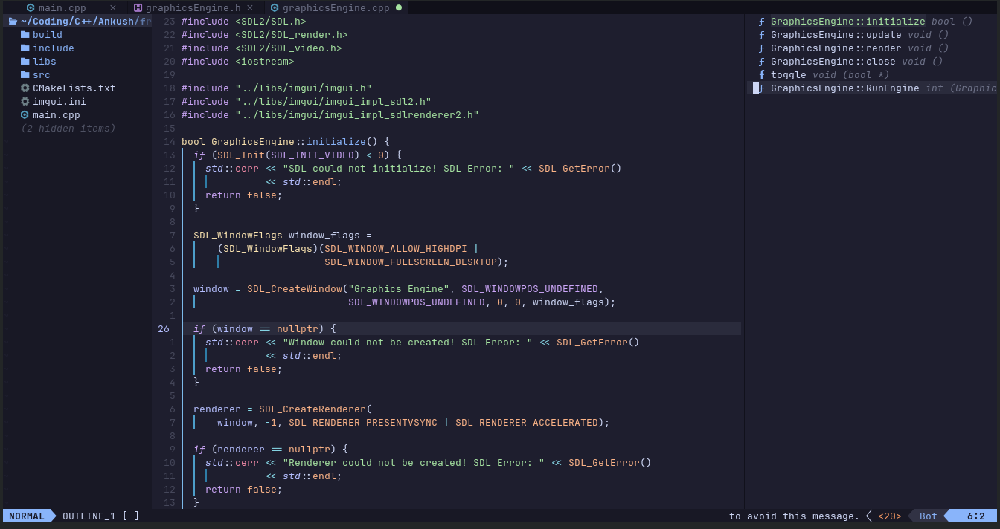
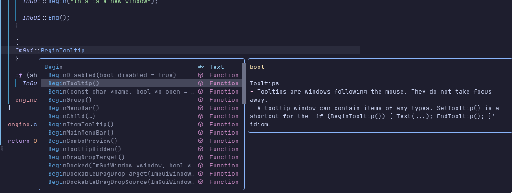
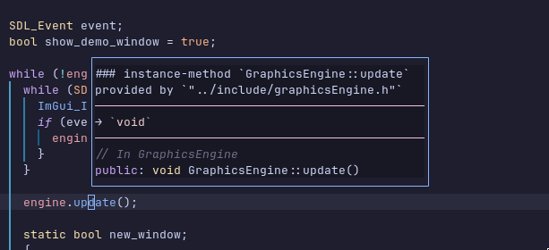
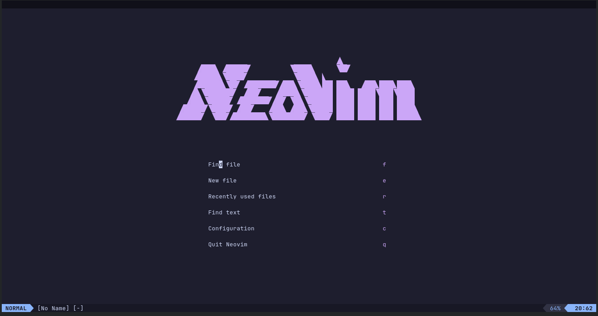

<h1 align="center" > Neovim C++ Configuration </h1> 
<details>
    <summary>Table of Contents</summary>
    <ol>
        <li>
            <a href="#Screenshot">Screenshots</a>
        </li>
        <li>
            <a href="#install">Installation</a>
        </li>
        <li>
            <a href="#usage">Usage</a>
        </li>
    </ol>
</details >
This Neovim configuration is crafted by me, primarily authored with careful attention to detail. While the majority of the setup reflects my unique approach, certain configurations are sourced from various repositories, particularly adopting recommended settings from plugin authors' original repositories.

<br><br>

<h2 id="Screenshot">
 
  <b> ScreenShots
  </b>
</h2>



#### Completions



#### Definition Hover



#### Startup Screen




<h2 id="install"> Installation</h2>
To use my config clone <a href="https://github.com/AnkushRoy-code/neovim-cpp-config.git">my repo </a> to your neovim config file, in linux it is ~/.config/nvim.

But before that you might want to backup your existing config and remove your local/share/nvim, you can do it by (in linux):

```bash
mv ~/.config/nvim ~/.config/nvim.backup
rm -rf ~/.local/share/nvim
```
This code will install the config:

```bash
git clone https://github.com/AnkushRoy-code/neovim-cpp-config.git ~/.config/
```
<details>
<summary> NOTE!! </summary>
<br>
    You might want to remove the Screenshots directory and README.md file because they are of no use. You can do that by:
        
    rm -rf ~/.config/nvim/Screenshots ~/.config/nvim/README.md
</details>


After that you can open neovim, wait a little and you should see Lazy install all the plugins.

```bash
nvim
```
Quit neovim and reopen again after all the plugins are installed by typing '<esc>:qa!' or alternatively you can power off your computer.

Now open neovim and type ':MasonInstallAll'

There it is, now you are ready to code some C++ and blow your leg off. You can change all the things you want, add plugins in the nvim/lua/plugins/your_plugin.lua file after making it.

If you are new to configuring neovim I highly recommend watching <a href="https://www.google.com/url?sa=t&source=web&rct=j&opi=89978449&url=https://www.youtube.com/watch%3Fv%3Dm8C0Cq9Uv9o&ved=2ahUKEwj3mces4cOFAxUSwjgGHa0kAKUQtwJ6BAgVEAI&usg=AOvVaw3l37-ZOdfWEAkvP4MVRD_U">Teej's 'The Only Video You need to get started with neovim'</a> or Typecraft's <a href="https://www.google.com/url?sa=t&source=web&rct=j&opi=89978449&url=https://www.youtube.com/playlist%3Flist%3DPLsz00TDipIffreIaUNk64KxTIkQaGguqn&ved=2ahUKEwj_7riO4sOFAxVe4jgGHT_mBZ0QFnoECBQQAQ&usg=AOvVaw2Oe1-1SEDQeFuGpzLABLGX">tutorial </a>series of neovim configuration.

I stole a considerable amount of code from the <a href="https://www.google.com/url?sa=t&source=web&rct=j&opi=89978449&url=https://github.com/nvim-lua/kickstart.nvim&ved=2ahUKEwid55XN4sOFAxUnn2MGHe65Dp4QFnoECAYQAQ&usg=AOvVaw0elyrLhk3eytqxq9Vwm2zh"> Kickstart </a>project by Teej, and from <a href="https://www.youtube.com/@typecraft_dev">Typecraft</a>'s videos, his config can be found <a href="https://github.com/typecraft-dev/dotfiles/tree/master/nvim">here</a>.

<h2 id="usage"> Usage </h2>

The one thing I'd suggest will be: `<space>sk` this will open up a 'Telescope' window that has almost all keybindings listed you can search from those, it would help. Moreover I'd like you not use my config for your own good, make your own just set this as your inspiration or whatever if you like and be sure to give a star in github I don't have those :( the only person who starred my repos are just me, so if you like just star or you don't have to :) its all right

<br><br>
